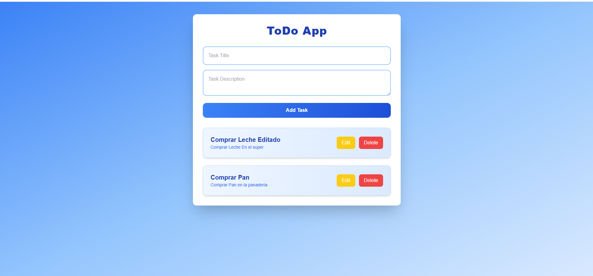
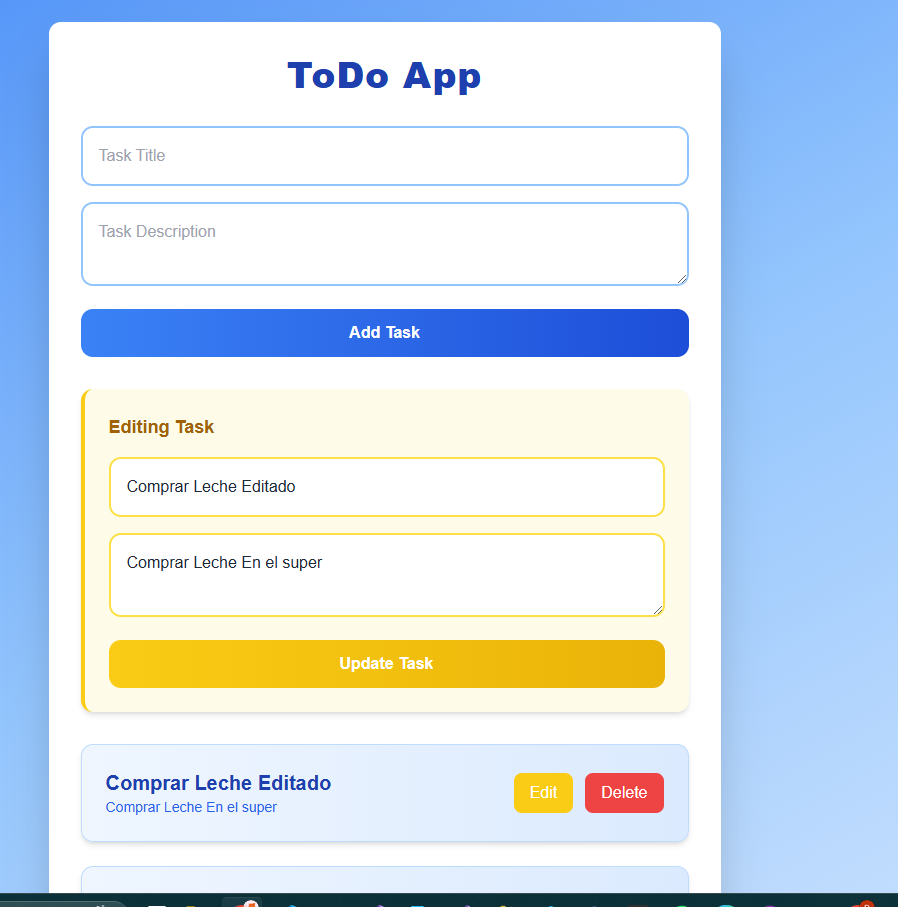
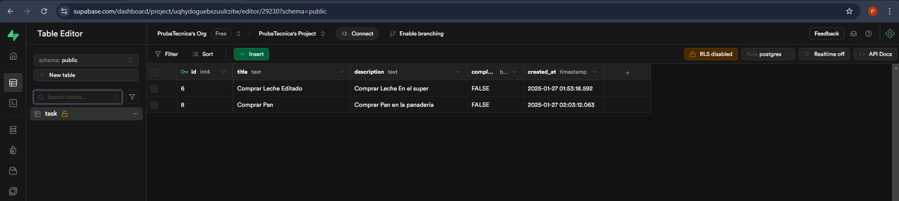

# Todo Tasks App

This is a [Next.js](https://nextjs.org) project bootstrapped with [`create-next-app`](https://nextjs.org/docs/app/api-reference/cli/create-next-app). It provides a simple and intuitive interface for managing tasks, including creating, reading, updating, and deleting (CRUD) operations.

## Getting Started

### Prerequisites

Make sure you have the following installed on your machine:
- [Node.js](https://nodejs.org/) (v18 or higher is recommended)
- [npm](https://www.npmjs.com/) or another package manager such as `yarn`, `pnpm`, or `bun`.

### Setup

1. Clone this repository to your local machine:
   ```bash
   git clone <repository-url>
   cd <repository-folder>
   ```

2. Install dependencies:
   ```bash
   npm install
   # or
   yarn install
   # or
   pnpm install
   ```

3. Create a `.env` file in the root of the project and define the API base URL:
   ```env
   NEXT_PUBLIC_API_URL=http://localhost:3000/api
   ```
   Replace `http://localhost:3000/api` with the URL of your API if it's hosted elsewhere.

4. Start the development server:
   ```bash
   npm run dev
   # or
   yarn dev
   # or
   pnpm dev
   # or
   bun dev
   ```

5. Open [http://localhost:3000](http://localhost:3000) in your browser to see the app.

### File to Start Editing

You can begin editing the main page by modifying `app/page.tsx`. The page will automatically update as you make changes.

## Features

- **Task Management**: Perform CRUD operations on tasks seamlessly.
- **Responsive Design**: Fully optimized for desktop and mobile devices.
- **Environment Variable Support**: Easily configure your API endpoint via `.env`.
- **Next.js Optimization**: Built-in performance optimizations using Next.js, including server-side rendering (SSR) and static site generation (SSG).
- **Customizable Fonts**: Uses [`next/font`](https://nextjs.org/docs/app/building-your-application/optimizing/fonts) for automatic font optimization.

## Learn More

To learn more about the technologies used in this app, explore these resources:

- [Next.js Documentation](https://nextjs.org/docs) - Learn about Next.js features and API.
- [Learn Next.js](https://nextjs.org/learn) - Interactive Next.js tutorial.
- [Vercel Fonts](https://vercel.com/font) - Explore fonts like Geist for enhanced typography.

## API Integration

This app requires a running API to handle CRUD operations. Make sure the API is configured and running before starting the app. The base URL of the API should be specified in the `.env` file as `NEXT_PUBLIC_API_URL`.

## Deploy on Vercel

Deploy your application effortlessly with [Vercel](https://vercel.com/). Follow these steps:

1. Push your code to a GitHub, GitLab, or Bitbucket repository.
2. Import the project into Vercel and configure the `NEXT_PUBLIC_API_URL` environment variable.
3. Deploy and access your app via the Vercel-generated URL.

Learn more about deploying Next.js apps with the [Next.js Deployment Documentation](https://nextjs.org/docs/app/building-your-application/deploying).


ScreenShots



